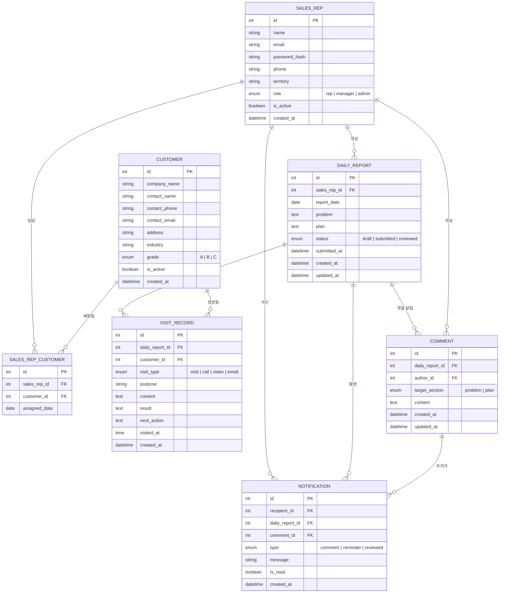

# 영업 일일 보고 시스템 요구사항 정의서

## 1. 시스템 개요

영업 사원이 매일 고객 방문 내용을 기록하고, 현재 과제·상담 사항과 내일 계획을 보고하며, 상급자가 피드백을 남길 수 있는 웹 기반 일일 보고 시스템.

---

## 2. 기능 요구사항

### 2.1 마스터 데이터 관리

| ID | 기능 | 설명 |
|---|---|---|
| FR-M01 | 고객 마스터 | 고객사 정보(회사명, 담당자, 연락처, 주소 등)를 등록·수정·삭제한다 |
| FR-M02 | 영업 마스터 | 영업 사원 정보(이름, 소속 팀, 직급, 담당 구역 등)를 등록·수정·삭제한다 |
| FR-M03 | 영업 사원 - 고객 담당 연결 | 영업 사원과 담당 고객을 연결하여 관리한다 |

### 2.2 일일 보고서

| ID | 기능 | 설명 |
|---|---|---|
| FR-R01 | 보고서 작성 | 영업 사원은 날짜별로 일일 보고서를 1건 작성한다 |
| FR-R02 | 보고서 상태 관리 | 보고서 상태는 초안(Draft) → 제출(Submitted) → 확인(Reviewed) 순으로 관리된다 |
| FR-R03 | 보고서 수정 | 제출 전(초안) 상태에서만 수정할 수 있다 |
| FR-R04 | 보고서 조회 | 상급자는 팀 전체 보고서를, 영업 사원은 본인 보고서를 조회한다 |

### 2.3 고객 방문 기록

| ID | 기능 | 설명 |
|---|---|---|
| FR-V01 | 방문 기록 추가 | 하루에 방문한 고객과 방문 내용을 여러 행으로 추가할 수 있다 |
| FR-V02 | 방문 유형 선택 | 방문 유형(직접방문, 전화, 화상, 이메일 등)을 선택할 수 있다 |
| FR-V03 | 방문 결과 기록 | 방문 목적, 상담 내용, 결과, 다음 액션을 기록한다 |
| FR-V04 | 고객 연동 | 방문 기록은 고객 마스터의 고객을 선택하여 연결한다 |

### 2.4 과제·상담 (Problem) 및 내일 계획 (Plan)

| ID | 기능 | 설명 |
|---|---|---|
| FR-P01 | 과제·상담 작성 | 현재의 문제점, 과제, 상담이 필요한 사항을 자유 형식으로 작성한다 |
| FR-P02 | 내일 계획 작성 | 내일 수행할 업무 계획을 자유 형식으로 작성한다 |
| FR-P03 | 상급자 댓글 | 상급자는 Problem·Plan 항목에 댓글로 의견·지시를 남긴다 |
| FR-P04 | 댓글 알림 | 댓글이 등록되면 해당 보고서 작성자에게 알림이 발송된다 |

---

## 3. 비기능 요구사항

| ID | 항목 | 내용 |
|---|---|---|
| NFR-01 | 보안 | 본인 보고서만 작성·수정 가능, 상급자는 팀 전체 조회·댓글 가능 |
| NFR-02 | 성능 | 보고서 목록 조회 1초 이내 응답 |
| NFR-03 | 데이터 보존 | 보고서 및 방문 이력 데이터 5년 보존 |
| NFR-04 | 감사 로그 | 보고서 생성·수정·제출 이력을 기록한다 |

---

## 4. ER 다이어그램



---

## 5. 엔티티 설명

### SALES_REP (영업 사원 마스터)
영업 사원 및 관리자 계정 정보. `role` 필드로 일반 영업 사원(rep), 팀장·상급자(manager), 시스템 관리자(admin)를 구분한다.

### CUSTOMER (고객 마스터)
방문 대상 고객사 정보. 등급(grade)으로 고객 중요도를 분류한다.

### SALES_REP_CUSTOMER (영업 사원-고객 담당 관계)
영업 사원과 고객의 담당 관계를 관리하는 중간 테이블. 한 고객을 여러 영업 사원이 담당하거나, 담당자 변경 이력 관리에 활용한다.

### DAILY_REPORT (일일 보고서)
영업 사원이 날짜별로 1건 작성하는 보고서. `problem`(과제·상담)과 `plan`(내일 계획)을 포함하며, 상태(status)로 워크플로우를 관리한다.

### VISIT_RECORD (고객 방문 기록)
일일 보고서 내 방문 기록으로, 하루에 여러 행을 추가할 수 있다. 방문 유형(visit_type), 목적, 내용, 결과, 다음 액션을 기록한다.

### COMMENT (댓글)
상급자가 보고서의 `problem` 또는 `plan` 섹션에 남기는 의견·지시 사항. `target_section`으로 어느 항목에 대한 댓글인지 구분한다.

### NOTIFICATION (알림)
댓글 등록, 보고서 확인 완료, 미제출 알림 등을 사용자에게 전달하는 알림 레코드.

---

## 6. 주요 업무 흐름

```
영업 사원        →   보고서 초안 작성 (방문 기록 추가, Problem/Plan 입력)
                 →   보고서 제출 (status: submitted)
상급자           →   보고서 확인 (status: reviewed)
                 →   Problem / Plan 에 댓글 작성
영업 사원        →   알림 수신 → 댓글 확인
```
##7. 화면 설계
@doc/SCREEN_DEFINITION.md

##8. API 명세서
@doc/API_SPEC.md

## 9. TEST 명세서
@TEST_SPEC.md

---

## 10. 기술 스택

| 분류 | 기술 |
|---|---|
| 언어 | TypeScript |
| 프레임워크 | Next.js (App Router) |
| UI 컴포넌트 | shadcn/ui + Tailwind CSS |
| API 스키마 정의 | OpenAPI (Zod 검증) |
| DB 스키마 정의 | Prisma.js |
| 테스트 | Vitest |
| 배포 | Google Cloud Run |