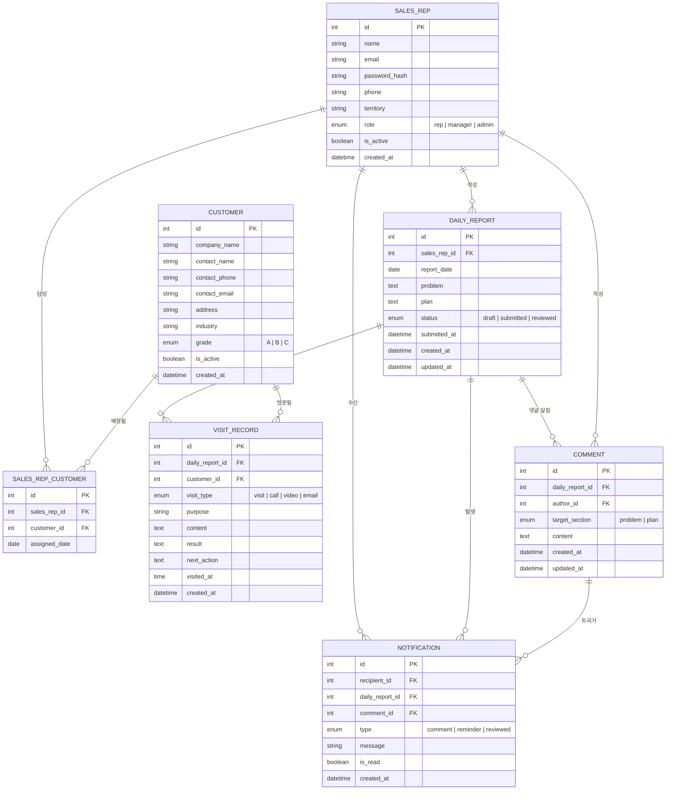

# 영업 일일 보고 시스템 ER 다이어그램

## 엔티티 관계 다이어그램

---

## 엔티티 설명

### SALES_REP (영업 사원 마스터)
영업 사원 및 관리자 계정 정보. `role` 필드로 일반 영업 사원(rep), 팀장·상급자(manager), 시스템 관리자(admin)를 구분한다.

### CUSTOMER (고객 마스터)
방문 대상 고객사 정보. `grade` 필드(A / B / C)로 고객 중요도를 분류한다.

### SALES_REP_CUSTOMER (영업 사원-고객 담당 관계)
영업 사원과 고객의 N:M 담당 관계를 관리하는 중간 테이블. 한 고객을 여러 영업 사원이 담당하거나, 담당자 변경 이력 관리에 활용한다.

### DAILY_REPORT (일일 보고서)
영업 사원이 날짜별로 1건 작성하는 보고서. `problem`(과제·상담)과 `plan`(내일 계획)을 포함하며, `status`(draft → submitted → reviewed)로 워크플로우를 관리한다.

### VISIT_RECORD (고객 방문 기록)
일일 보고서 내 방문 기록. 하루에 여러 행을 추가할 수 있으며 방문 유형(visit_type), 목적, 내용, 결과, 다음 액션을 기록한다.

### COMMENT (댓글)
상급자가 보고서의 `problem` 또는 `plan` 섹션에 남기는 의견·지시 사항. `target_section`으로 어느 섹션에 대한 댓글인지 구분한다.

### NOTIFICATION (알림)
댓글 등록(comment), 보고서 확인 완료(reviewed), 미제출 알림(reminder) 등을 사용자에게 전달하는 알림 레코드.

---

## 관계 요약

| 관계 | 카디널리티 | 설명 |
|---|---|---|
| SALES_REP → SALES_REP_CUSTOMER | 1:N | 영업 사원은 여러 고객을 담당 |
| CUSTOMER → SALES_REP_CUSTOMER | 1:N | 고객은 여러 영업 사원에게 배정 가능 |
| SALES_REP → DAILY_REPORT | 1:N | 영업 사원은 날짜별로 보고서 작성 |
| DAILY_REPORT → VISIT_RECORD | 1:N | 보고서 하나에 방문 기록 여러 건 |
| CUSTOMER → VISIT_RECORD | 1:N | 고객은 여러 방문 기록에 연결 |
| DAILY_REPORT → COMMENT | 1:N | 보고서 하나에 댓글 여러 건 |
| SALES_REP → COMMENT | 1:N | 상급자는 여러 댓글 작성 가능 |
| SALES_REP → NOTIFICATION | 1:N | 사용자는 여러 알림 수신 |
| DAILY_REPORT → NOTIFICATION | 1:N | 보고서 이벤트로 알림 발생 |
| COMMENT → NOTIFICATION | 1:N | 댓글 등록 시 알림 트리거 |
